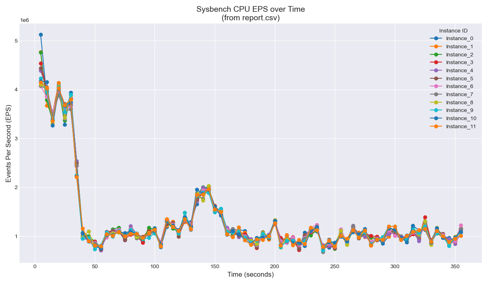

# Тестирование CPU с помощью Sysbench
## [ПОЛНЫЙ ОТЧЕТ СМОТРИТЕ ТУТ](https://github.com/alice3e/YADRO_benchmarking/blob/main/docs/report.md)

Программа написана в качестве тестового задания в Yadro Импульс 2025, позиция Сис. Админ


## Обзор

Эта программа (точнее набор программ) предоставляет механизм для параллельного запуска нескольких однопоточных тестов `sysbench cpu`, агрегирования результатов и генерации итогового отчета и графика производительности. Основная цель — симулировать многопоточную нагрузку на CPU с помощью независимых экземпляров `sysbench` и визуализировать их производительность во времени.

## Возможности

* Одновременный запуск указанного числа экземпляров `sysbench cpu`
* Каждый экземпляр `sysbench` работает в однопоточном режиме (`--threads=1`)
* Попытка запуска экземпляров `sysbench` с максимальным приоритетом планировщика (`nice -n -20`) для оптимального распределения ресурсов (*!!требует привилегий root!!*)
* Настраиваемое количество параллельных экземпляров и длительность теста через аргументы командной строки.
* Сбор всех логов в единый файл.
* Автоматический парсинг лог-файла для извлечения промежуточных и итоговых данных о количестве Событий В Секунду (EPS).
* Генерация CSV отчета, суммирующего результаты EPS по времени для каждого экземпляра.
* Создание PNG-графика, визуализирующего производительность каждого экземпляра в течение времени теста.
* Автоматическое создание резервных копий существующих файлов результатов (`.log`, `.csv`, `.png`) предыдущих запусков путем добавления числовых суффиксов (`.1`, `.2` и т.д.).



## Зависимости

* `sysbench`:
* `nice`
* `python`
* `pandas` и `matplotlib`
* **Доступ `sudo`:** Необходим для запуска основного скрипта бенчмарка (`benchmark.sh`), так как он пытается использовать `nice -n -20` для повышения приоритета.

## Использование

Запуск через скрипт `benchmark.sh`. Он управляет выполнением вспомогательных Python-скриптов.

```bash
sudo ./benchmark.sh <num_threads> <time_seconds>
```

пример:

```bash
sudo ./benchmark.sh 4 120 - 4 потока на 120 секунд
```

### Входные аргументы

1. **`<num_threads>`** (Обязательный): Положительное целое число, указывающее количество параллельных экземпляров `sysbench` для запуска.
2. **`<time_seconds>`** (Обязательный): Положительное целое число, указывающее длительность (в секундах), в течение которой должен работать каждый экземпляр теста `sysbench`.

## Описание работы

Скрипт `benchmark.sh` выполняет следующие шаги последовательно:

1. **Разбор аргументов:** Проверяет обязательные аргументы `<num_threads>` и `<time_seconds>`.
2. **Резервное копирование:** Проверяет наличие существующих файлов вывода (`sysbench_cpu_report.log`, `report.csv`, `graph.png`) и переименовывает их, добавляя следующий доступный числовой суффикс (например, `report.csv.1`, `report.csv.2`), чтобы предотвратить перезапись.
3. **Запуск `main.py`:** Выполняет основной Python-скрипт с помощью `sudo`. Этот скрипт запускает `<num_threads>` параллельных процессов `sysbench`, пытается установить их приоритет с помощью `nice` и собирает их объединенный вывод в `sysbench_cpu_report.log`.
4. **Запуск `parser.py`:** Выполняет скрипт-парсер. Он читает `sysbench_cpu_report.log` (по умолчанию) и генерирует `report.csv`, содержащий разобранные данные EPS.
5. **Запуск `graph.py`:** Выполняет скрипт для построения графика. Он читает `report.csv` (по умолчанию) и генерирует `graph.png`, визуализируя данные EPS во времени.

## Выходные файлы

* **`sysbench_cpu_report.log`**: Содержит необработанные, объединенные потоки стандартного вывода и стандартных ошибок всех выполненных экземпляров `sysbench`.
* **`report.csv`**: CSV-файл со строкой заголовка. Первая колонка содержит временные точки ('5s', '10s', ..., 'Final_Avg_EPS'). Последующие колонки ('Instance_0', 'Instance_1', ...) содержат соответствующие значения EPS для каждого экземпляра `sysbench` в данный момент времени или итоговое среднее значение EPS.
* **`graph.png`**: Изображение в формате PNG, отображающее значения EPS (ось Y) в зависимости от времени в секундах (ось X) для каждого экземпляра `sysbench`.
* **`*.log.N`, `*.csv.N`, `*.png.N`**: Файлы резервных копий, созданные из предыдущих запусков, где `N` — целое число (1, 2, 3,...).

## Примечания

* Запуск `benchmark.sh` с `sudo` необходим для того, чтобы команда `nice -n -20` внутри `main.py` успешно повысила приоритет процессов `sysbench`. Без `sudo`, `nice` может завершиться без сообщения об ошибке или запустить `sysbench` с приоритетом по умолчанию.
* Вспомогательные Python-скрипты (`parser.py`, `graph.py`) при вызове из `benchmark.sh` полагаются на имена файлов ввода/вывода по умолчанию (`sysbench_cpu_report.log`, `report.csv`, `graph.png`), хотя они сохраняют возможность принимать имена файлов через аргументы при автономном запуске.
