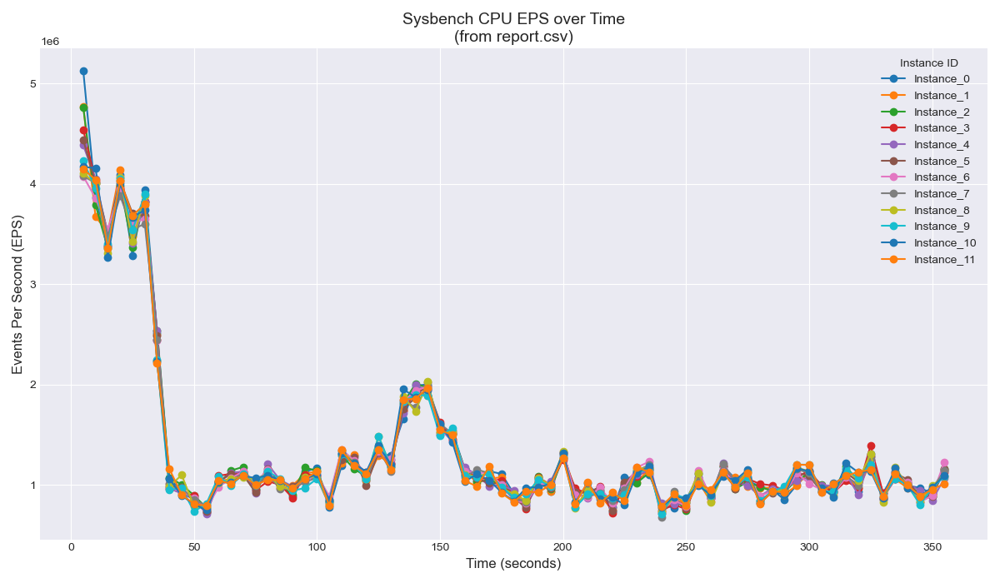

**1. Введение и цели**

Данный отчет представляет результаты сравнительного анализа производительности центральных процессоров (CPU) на трех различных аппаратных платформах с использованием стандартизированного теста `sysbench cpu`. Тестирование проводилось с помощью набора скриптов, обеспечивающих параллельный запуск нескольких однопоточных экземпляров `sysbench` для симуляции многопоточной нагрузки.

Основные цели исследования:

* Оценить пиковую производительность одного вычислительного потока на каждой платформе.
* Исследовать масштабируемость и стабильность производительности при увеличении количества параллельных вычислительных потоков.
* Выявить характерные особенности поведения каждой системы под синтетической CPU-нагрузкой.
* Определить оптимальную длительность теста (`T`) для получения репрезентативных и устойчивых результатов на разных платформах.

**2. Методология тестирования**

* **Инструмент:** `sysbench`
* **Параметры `sysbench cpu`:**
  * `--threads=1` (для каждого параллельного экземпляра).
  * `--cpu-max-prime=50000` (сложность вычислений).
  * `--report-interval=5` (частота промежуточных отчетов).
  * `--time=<T>` (переменная длительность теста).
* **Автоматизация:** Использовался набор скриптов:
  * `main.py`: Запуск N параллельных процессов `sysbench`, сбор логов. Попытка запуска с `nice -n -20` (требует `sudo`).
  * `parser.py`: Разбор лог-файла (`sysbench_cpu_report.log`), генерация CSV-отчета (`report.csv`).
  * `graph.py`: Чтение CSV-отчета, генерация графика производительности (`graph.png`).
  * `benchmark.sh`: запуск скриптов, управление аргументами (`num_threads`, `time`), автоматическое резервное копирование предыдущих результатов.
* **Метрика:** Основной показатель производительности – EPS (Events Per Second), измеряемый `sysbench`.

**3. Описание тестовых систем**

* **Система 1: Виртуальная машина Debian на Xeon**
  * **Платформа:** Виртуальная машина Debian.
  * **Среда виртуализации:** Proxmox VE.
  * **Хост-сервер CPU:** Intel Xeon E5-2680v4 (Архитектура x86-64, 14 ядер / 28 потоков @ 2.4-3.3 GHz).
  * **Особенности:** Серверный процессор.
* **Система 2: Orange Pi Zero 3**
  * **Платформа:** Orange Pi Zero 3 (Одноплатный компьютер).
  * **SoC:** Allwinner H618.
  * **CPU:** Quad-Core ARM Cortex-A53 (Архитектура ARMv8-A, 4 ядра / 4 потока).
  * **Особенности:** Энергоэффективные ядра ARM.
* **Система 3: MacBook Pro M3 Pro**
  * **Платформа:** macOS на MacBook Pro.
  * **Процессор:** Apple M3 Pro (Архитектура ARMv8-A).
  * **Особенности:** Гетерогенная архитектура с высокопроизводительными (P-cores) и энергоэффективными (E-cores) ядрами (например, 6P+6E = 12 ядер). Сложный планировщик macOS.

**4. Анализ результатов по системам**

**4.1. Система 1: Виртуальная машина Debian на Xeon**

* **Производительность:**
  * При низкой и средней нагрузке (1-8 параллельных потоков) система демонстрирует высокую и стабильную производительность на поток, достигающую ~102 млн EPS.
  * При высокой нагрузке (16 потоков) наблюдается **значительная деградация и стратификация производительности**. Потоки делятся на группы с разной производительностью (высокой ~100 млн EPS и низкой ~80-95 млн EPS), общая производительность становится нестабильной.
* **Интерпретация:** Стабильность при 1-8 потоках говорит об эффективном использовании выделенных vCPU. Планировщики гипервизора и гостевой ОС не могут эффективно распределить нагрузку, превышающую доступные ресурсы, что приводит к неоптимальному размещению потоков, частым переключениям контекста и, как следствие, к снижению и нестабильности производительности. Возможен также вклад троттлинга.

<table>
  <tr>
    <td></td>
    <td></td>
  </tr>
  <tr>
    <td></td>
    <td></td>
  </tr>
</table>

**4.2. Система 2: Orange Pi Zero 3 (Allwinner H618)**

* **Производительность:**
  * Система показывает высокую стабильность при нагрузке до 4 потоков.
  * Пиковая производительность одного ядра составляет ~87 млн EPS.
  * При полной загрузке (4 потока) средняя производительность на поток практически не снижается (~86.6 млн EPS), но наблюдается увеличение числа мелких, кратковременных флуктуаций.
* **Интерпретация:** Производительность соответствует ожиданиям от 4 энергоэффективных ядер Cortex-A53. Система отлично масштабируется в пределах своих физических ядер. Отсутствие виртуализации и гетерогенности ядер способствует стабильности.

<table>
  <tr>
    <td></td>
    <td></td>
  </tr>
  <tr>
    <td></td>
  </tr>
</table>

**4.3. Система 3: MacBook Pro (Apple M3 Pro)**

* **Производительность:**
  * **Наивысшая пиковая однопоточная производительность** среди всех систем. Но скорее всего результат не является сравнимым так как sysbench может отличаться на MacOS.
  * При низкой нагрузке (3 потока) производительность стабильна и высока.
  * При полной загрузке всех ядер (12 потоков) происходит резкое падение среднего EPS.
* **Интерпретация:** Поведение полностью определяется работой планировщика macOS. При низкой нагрузке не происходит троттлинга. При увеличении нагрузки до числа ядер, возможно, снижаются частоты и/или планировщик начинает периодически замедлять яжра для управления температурой/энергопотреблением, вызывая провалы. 

<table>
  <tr>
    <td></td>
    <td></td>
  </tr>
  <tr>
    <td></td>
    <td></td>
  </tr>
</table>

**5. Сравнительный анализ**

* **Абсолютная производительность (на поток):**

  1. **Apple M3 Pro (P-core):** Значительно превосходит остальные (~15+ млн EPS) (не стоит сравнивать, так как слишком болшой отрыв в данных).
  2. **Xeon E5-2680v4 (в ВМ):** Хорошая производительность (~102 млн EPS), но ограничена конфигурацией ВМ и хоста.
  3. **Orange Pi (Cortex-A53):** Самая низкая производительность (~87 млн EPS), соответствует классу энергоэффективных ядер.

**6. Анализ требований к длительности тестов (T)**

* **Быстрая стабилизация:** На простых системах с гомогенными ядрами и без виртуализации (Orange Pi) производительность стабилизируется быстро (< 10с).
* **Выявление нестабильности:** На системах с потенциальными узкими местами (Xeon VM при перегрузке vCPU) или сложным поведением планировщика (M3 Pro) требуется больше времени для проявления характерных эффектов (стратификация, провалы).
* **Достаточная длительность:** **180 секунд (3 минуты)** показали себя как достаточная длительность для всех протестированных систем, чтобы:
  * Пройти начальную фазу.
  * Оценить производительность в установившемся режиме.
  * Выявить ключевые артефакты поведения под нагрузкой (нестабильность, провалы, стратификация).
* **Более короткая длительность:** 60 секунд могут быть достаточны для систем типа Orange Pi или для оценки производительности Xeon/M3 Pro при *низкой* нагрузке, но недостаточны для полного анализа поведения при высокой нагрузке.
* **Более длительные тесты:** Не принесли принципиально новой информации о характере производительности для *данного типа* теста, но могут быть полезны для выявления теплового троттлинга при стресс-тестировании. Разница в поведении ядер Xeon при тесте длиной 3 минуты и 10 не было обнажено.
